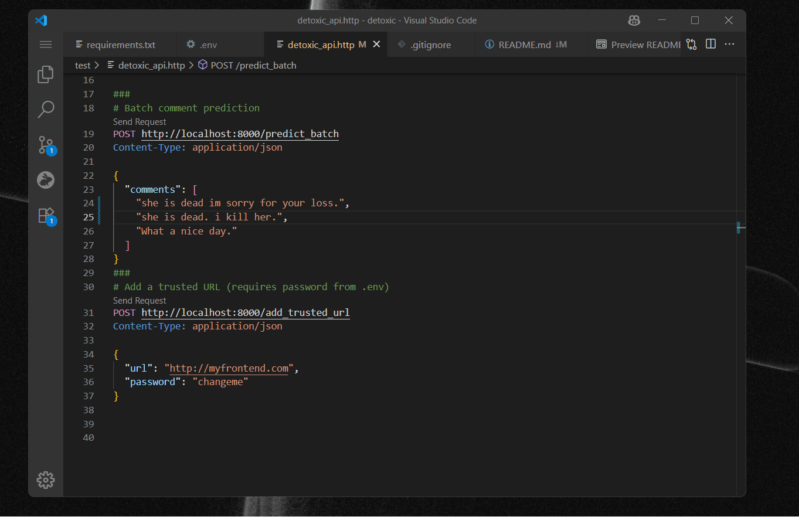

# Detoxic: Toxic Comment Classification API

This project provides a FastAPI-based REST API for detecting toxic comments using a trained CNN model. It includes a training notebook, model export, and secure CORS management.

## Features
- Predict toxicity of single or batch comments via REST API
- CNN model trained on Jigsaw Toxic Comment dataset
- Tokenizer and model export for easy deployment
- CORS restricted to trusted URLs (editable via API or YAML)
- Add trusted origins securely with a password


## Example: API in Action



_Above: Example screenshot of the Detoxic API being tested in VS Code using the .http file._

## Setup
1. Clone the repo and navigate to the folder.
2. Create a virtual environment and install requirements:
   ```
   python -m venv .venv
   .venv\Scripts\activate
   pip install -r requirements.txt
   ```
3. Set up `.env` File:
   ```
   MODEL_PATH=toxic_comment_cnn_model.h5
   TOKENIZER_CONFIG=tokenizer_config.json
   MAX_SEQUENCE_LENGTH=100
   TRUSTED_URLS_PASSWORD=changeme
   ```
4. (Optional) Edit `trusted_urls.yaml` to set allowed origins.

## Running the API
Start the FastAPI server:
```
fastapi run detoxic.py
```

## API Endpoints
- `POST /predict` — Predict toxicity for a single comment
- `POST /predict_batch` — Predict toxicity for a list of comments
- `POST /add_trusted_url` — Add a new trusted CORS origin (requires password)

## Testing
Use the requests in `test/detoxic_api.http` or your favorite HTTP client (e.g., Postman, curl).

## Training
See `train/Train.ipynb` for model training and export steps.

## License
MIT
